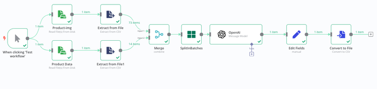
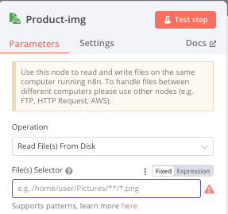
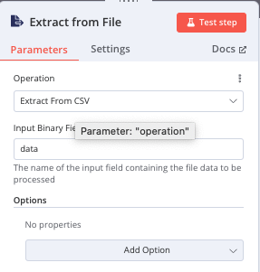
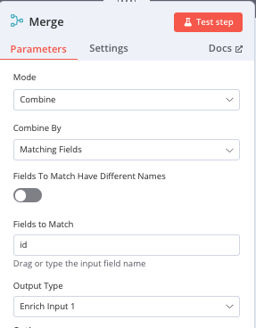
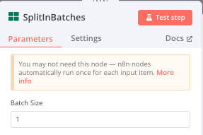
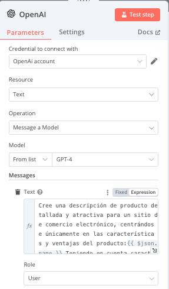
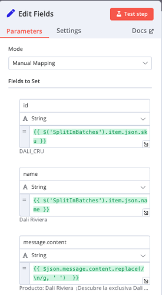
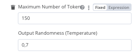
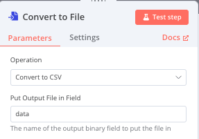

# Automating Product Description Generation with N8n and OpenAI

Have you ever found yourself in the uncomfortable situation of writing tedious product descriptions for an online catalog?

I'm convinced that if you run an ecommerce business, you are aware that a good description can change how visits convert into sales, but writing content for hundreds of products can be a bit exhausting.

In this article, I want to explain how you can automate the generation of new descriptions with n8n and OpenAI, and ultimately have everything well integrated into a CSV file ready to be used.

### 1. Tools.

- **n8n** (https://docs.n8n.io/):A workflow automation platform that allows you to connect and automate tasks between different applications and services.

- **Files with product information**(in my case, 2 .csv files)

- **OpenAI Api Key**(to make the requests). We will need to register at: (https://platform.openai.com/docs/overview), and make a deposit (I believe $5) to be able to use it.

### 2.Problem & Solution.

- **Problem**

Generating personalized and efficient product descriptions, emphasizing that they should be created for an ecommerce context.

The prompt could be as follows:

```
“Create a detailed and attractive product description for an ecommerce site, just focusing on the features and benefits of the product: {{ $json.name }}. Considering features such as: {{ $json.name }}, {{ $json.channel }}, {{ $json.sku }}, {{ $json.url }}”

```

(The {{json.name}}, {{json.channel}}, etc., will be replaced by the product features contained in the files.)

- **Solution**

We are going to create an automated workflow that will allow OpenAI to generate these descriptions for each product, adapting them according to the characteristics of each one.

### 3. Workflow.

N8n works with Nodes: a node in n8n is a unit of action within an automated workflow. Each node represents a specific task or process, such as sending an email, retrieving data from an API, or transforming information.

Nodes are connected to each other to create more complex automated workflows. For example, you could have a node that retrieves data from a source, another that transforms it, and a third that sends it to a database.



### 4. Summary of the Nodes Used.

- **Read Files from Disk** —> with this node, the files will be uploaded into n8n from your computer. With n8n, you can configure various file input modes; another way could be setting up a space in Google Drive and selecting the files from there...



- **Extract from File (extract from .csv)** --> It's responsible for extracting data from the CSV file related to the images or product data. Here, the data is converted into a manageable format that can be processed in N8n.



- **Merge** --> In our case, it combines the data from the two csv sources (images and product data) using a primary key (product ID).

This way, all the characteristics of each product are unified into a single data block.

Since the image file contained more information than the data file, I joined them using a LEFT JOIN (Enrich input 1 in the node) (see SQL info. I'm attaching a quite comprehensive course: https://sqlbolt.com/ that I discovered thanks to the great @midudev).



- **Split In Batches** --> It divides the data into smaller batches. This is useful when you need to send large volumes of data to the OpenAI API to avoid overloading the system or hitting API limits. In our case, we had 73 records, and for the initial test, we configured Split in Batches to 1 so that it would only pass one item at a time, allowing us to check that the calls are made correctly.



If we are working with very large volumes of data, it is advisable to test with a few records first to ensure that the calls are made correctly and to avoid unnecessary API costs.

- **OpenAI(Message Model)** --> Thanks to this node, we connect to the OpenAI API to automatically generate product descriptions based on the data provided in the previous steps. It sends the product information and receives back the descriptions generated by the language model. For this, we will need to register the API Key that we obtained earlier.

**IMPORTANT**: We need to have our OpenAI API Key created and add it in the "Credential to connect with" field.



- **Edit Field** --> Here you can edit the data fields before generating the final file. We can add the fields we want our file to contain (e.g., in our case: id, name, and description (message.content)).

Additionally, we will need to indicate the type of each field below it (in our case, all fields are strings (text), but they could be numbers, booleans, etc.).



In additional options, we have added two:

- **Maximum number of characters to 150** (so they are not too long).

- **Temperature**: Controls the randomness in the model's responses. This parameter ranges from 0 to 1. A lower value (close to 0) will make the model more deterministic and repetitive, generating more predictable and conservative responses.

A higher value (close to 1) increases randomness and creativity, making the responses more varied and creative. In the image, the temperature is set to 0.7, which is an intermediate value that allows a good balance between creativity and coherence in the responses.



- **Convert to File (to csv)** --> This node takes the data, including the descriptions generated by OpenAI, and converts it into a new CSV file, which will be ready to be downloaded or used on other platforms.



### 5. Conclusion.

This workflow in n8n takes two CSV files (one with images and another with product data), combines them using the id field, and then automatically generates product descriptions using OpenAI. Finally, the descriptions and data are consolidated into a CSV file that is generated as output.

This type of workflow automates a task that would normally take a lot of time if done manually, which can be very useful in an e-commerce context where creating personalized content for many products is essential.
